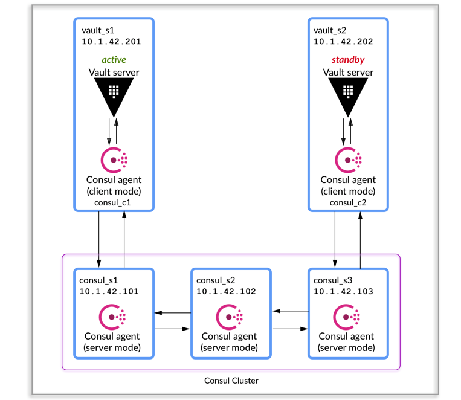

# vault-consul-simple-infra

Simple vault infrastructure using consul as backend and storage.




## Consul Instances 

### Start consul cluster (Server mode)

```$ consul agent -config-file=/consul.d/config/server.json -ui -pid-file=/var/run/consul/consul.pid &```

## Vault Instances 

### Start consul cluster (Client mode)

```$ consul agent -config-file=/consul.d/config/client.json -ui -pid-file=/var/run/consul/consul.pid &```

### Start vault server

```$ vault server -config=/vault.d/server.hcl -log-level=debug &```

```$ export VAULT_ADDR='http://127.0.0.1:8200'```

```$ vault operator init```

```$ vault operator unseal $(Unseal_key)```
